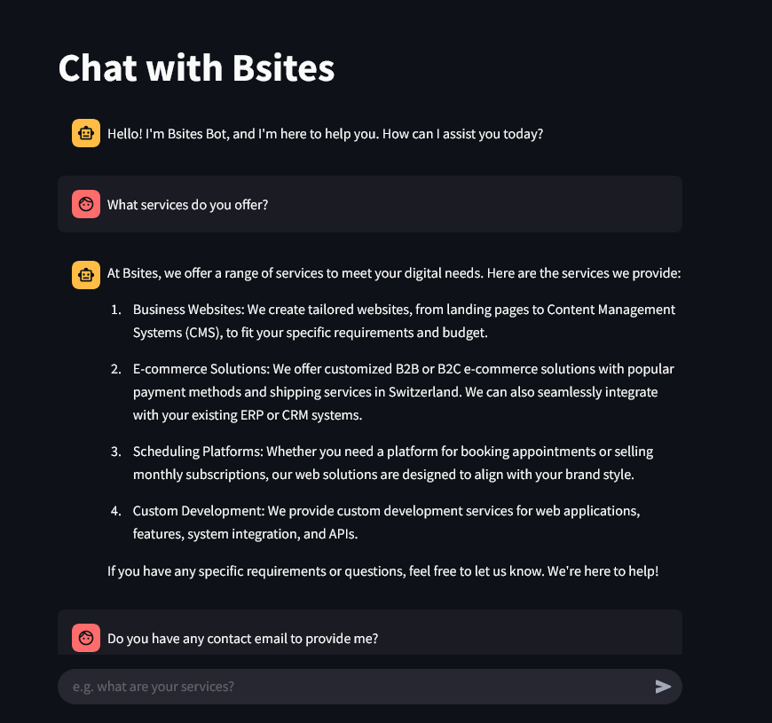

# WebChat

WebChat is a chat bot that extracts and cleans the content of a website, allowing you to interact with it through a conversational interface. 


## Features

- **Ensemble retriever**: combines keyword and semantic search to retrieve the source documents.
- **Maximum Marginal Relevance**: re-ranks source documents maximizing the diversity and reducing redundancy.
- **Reorder**: places the most relevant documents earlier in the context to avoid the lost-in-the-middle problem.


## Installation

1. Set the following environment variables in an .env file in project directory:
```
OPENAI_API_KEY
WEBSITE_NAME
WEBSITE_URL
WEBSITE_DESCRIPTION
```

2. Create a virtual environment and install dependencies:
```
pip install -r requirements.txt
```

3. Ingest the website content:
```
python src/ingest
```

4. Run the streamlit web app:
```
streamlit run src/app.py
```


## Screenshot and demo video



[](https://drive.google.com/file/d/19oFXdhismVUNWLNoVhvjSX23qW1PxtgM/view?usp=sharing)


## References

1. **LangChain Documentation**:
   [https://docs.langchain.com/](https://docs.langchain.com/)

2. **Streamlit Documentation**:
   [https://docs.streamlit.io/](https://docs.streamlit.io/)

3. **Platzi LangChain Course for Document Management and Retrieval**:
[https://platzi.com/cursos/langchain-documents/](https://platzi.com/cursos/langchain-documents/)
